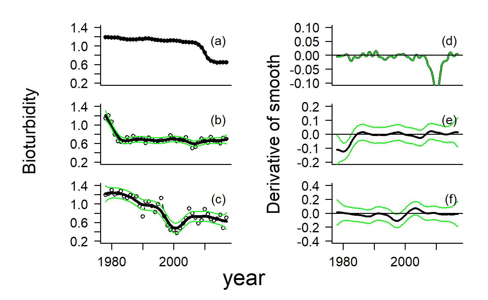

---
title: 'What are models for and <br>can we use them more effectively?'

author: "Kim Cuddington (https://ecotheory.ca) <br/>University of Waterloo"
date: "16/05/2022"
output: 
  ioslides_presentation: 
    keep_md: yes
smaller: true
css: quantbiotalk.css
---
<style>
.forceBreak { -webkit-column-break-after: always; break-after: column; }
</style>
<style>
p.caption {
  font-size: 0.6em;
}
</style>
<style>#margins > p {margin-top: -50px;} </style>
<style>#margins2 > p {margin-top: -50px;} </style>
<style>
p.comment {
background-color: #F2D4D7;
padding: 10px;
border: 1px solid black;
margin-left: 25px;
border-radius: 5px;
font-style: italic;
color: black;
}

</style>

<style>
/* Your other css */

.section .reveal .state-background {
    background: url(environmental_modelling.jpg);
    background-position: center top;
    background-attachment: fixed;
    background-repeat: no-repeat;
    background-size: 80% 80%;
}
</style>

```{r setup, include=FALSE}
library(knitr)
knitr::opts_chunk$set(echo = FALSE)
```
```{css echo = FALSE}
body {line-height: .8;}
h2 {margin-bottom: -50px;}
```
## Co-authors
Laura Bell, Warren Currie (DFO), Stephi Sobek-Swant (rare reserve), John Drake, Wonhyo Lee & Madison Brook (DFO)

## Today
[ecotheory.ca/theorydata/datatheory.html](ecotheory.ca/theorydata/datatheory.html)

1. Epistemology: a brief and idiosyncratic overview
2. Mechanism and novel conditions
3. How can we use models more effectively
    - <span style="color:#8b0000; font-weight: bold">Focus on mechanism:</span> Predators that benefit their prey (Hine's Emerald dragonfly) 
   - <span style="color:#8b0000; font-weight: bold">Understand all the model predictions:</span> Regime shifts or transients (Bay of Quinte)
   - <span style="color:#8b0000; font-weight: bold">Move between mechanistic and data-driven models:</span> Machine learning to suggest mechanism for range limitation (Giant Hogweed)
 

# Epistemology: How do we gain knowledge?


## Gaining knowledge in science
- reality
- data: a biased subset of reality
- opinion: what we believe about reality
<br/><br/>
<span style="color:#8b0000; font-weight: bold">$\rightarrow$<bold>Science</bold></span>: an attitude linking belief and data, whereby we do not, 
at least in principle, maintain beliefs that are not supported by data 

## Scientific Theory
- We may refer to beliefs supported by data, or which at least
do not always contradict data, as <span style="font-weight: bold">theories</span>

- We will like theories to have a few other properties such as: 
    - logical consistency
    - coherence with other scientific theories

## Where do models fit in? 

- Model: a representation of reality

- A structure that: 
    - embodies some of our beliefs about reality <font size="5"><br>e.g., predators negatively impact 
prey populations $\frac{dN}{dt}=f(N)-g(N,P)$</br></font>
    - mimics some aspect of data <font size="5"><br>e.g., linear regression $y_i=\beta_0+\beta_1x_i+\epsilon$</br></font>
    - combines these two components (e.g., makes a statement about the expected pattern of data in light of theory<font size="5"><br>predator consumption rate can be described as a type II functional response: $\frac{g(N,P)}{P}=\frac{aN}{N+N_0}$</font> )

## Types of models  {.columns-2}


- conceptual (e.g., a statement)
<br/><br/> 

- physical (e.g., lab experiment)
<br/><br/> 

- mathematical (e.g., ODE)
<br/>

- data-driven (e.g., regression)
<br/><br/>

- computational (e.g., IBM)

<br/>
<br/>
<p class="forceBreak"></p>
    

<font size="4"> "predators can positively impact prey"</font>


```{r pressure, echo=FALSE, fig.align = 'left', fig.cap="Bell & Cuddington 2018", out.width = '35%'}

```
 $\frac{dN}{dt}=f(N,E)+g(N,P,E)$


 $E(y_i)=β_0+f(x_i)+\epsilon$ 


```{r p2, echo=FALSE, fig.align = 'left', fig.cap="Cuddington & Yodzis 1999", out.width = '25%'}
knitr::include_graphics("euclidIBM.png")
```
## Characteristics of models 
- trade off precision, generality and realism (Levins 1966)
- a model is more specific than a theory, but less detailed than reality
- why? a one-to-one scale map of a city may include all details but is useless as a guide to finding your hotel

<font size="4"><p class="comment">"We actually made a map of the country, on the scale of a mile to the mile!"</br>"Have you used it much?" I enquired.</br>"It has never been spread out, yet," said Mein Herr,<br> "the farmers objected: they said it would cover the whole country, and shut out the sunlight! So we now use the country itself, as its own map, and I assure you it does nearly as well.<br/><br/>
Lewis Carroll - The Complete Illustrated Works. Gramercy Books, New York (1982)</font>
</p>

## Main characteristic of models {.flexbox .vcenter} 
<div class="notes">
-models are always false in some aspects of their representation theory or data

</div>

<br/><br/><br/>
<div align="center">
<font size="7">Theory $\neq$ Model $\neq$ Reality </font></div>


## Complex models are not necessarily better: <br/>Math and computation
- "if we put more details in, it will be a better reflection of reality" 
- this syllogism commits fallacy of undistributed middle
- think about the map example: complexity is not necessarily helpful for explanation
- complexity is also a bugbear for exploring model assumptions <br/><br/>(e.g., Valle et al. (2009) found that alternate modeling assumptions in the forest stand simulation model SYMFOR can account for 66–97% of the variance in predicted stand dynamics but note that least they COULD do this analysis because the model was not that complex).

## Complex models are not necessarily better: Data
- complexity is not necessarily helpful for prediction either


<div style="float: left; width: 50%;">
- complex models are prone overfitting

<font size="4"><p class="comment">"With four parameters I can fit an elephant, and with five I can make him wiggle his trunk."<br/><br/>
    John von Neumann
</p></font>

- don't be impressed when a complex model fits a data set well. With enough parameters, you can fit any data set
</div>

<div style="float: right; width: 50%;">
```{r p4, echo=FALSE, fig.align = 'center',  out.width = '65%'}

```
<font size="2"><div align="center">[Mayer et al. (2010)](https://doi.org/10.1007/s10530-021-02645-x)</div></font>`</div>

## Overfitting
- but it fits right?? 
- no not really: overfitting occurs when the data-driven model tries to cover all the data points  in the dataset
- as a result, the model starts caching noise and inaccuracies present in the dataset
- when your model fits your data perfectly, it is unlikely to fit new data well

```{r p3, echo=FALSE,fig.align = 'center', out.width = '80%'}


```
<font size="2"><div align="center">[Lever et al. (2016)](https://www.nature.com/articles/nmeth.3968)</div></font>


# <span style="color:red">$\rightarrow$</span>Complex models $\neq$ accurate prediction


## Simplicity is not necessarily better: Data
- "if we make it simple, we will capture general principles/effects"
- for data-driven models, underfit happens when your model is not complicated enough
- underfitting introduces bias, such that there is systematic deviation from the true underlying estimator

## Simplicity is not necessarily better: <br/>Math and computation
- Occam's razor: "entities should not be multiplied beyond necessity"
- simplified descriptions may omit important contingencies
- may also omit time-varying variables, significant effects of environmental stochasticity etc
<font size="4"><p class="comment">“There are two ways of doing calculations in theoretical physics”, he said. <br/>“One way, and this is the way I prefer, is to have a clear physical picture of the process that you are calculating. The other way is to have a precise and self-consistent mathematical formalism. You have neither.” <br/><br/>Enrico Fermi speaking to Freeman Dyson about pseudoscalar meson theory </p></font>

<font size="2"><div align="center">[Dyson (2004)](https://www.nature.com/articles/427297a)</div></font>

- may have significant analysis/implementation issues and no mechanism, in which case the simplicity is self-defeating


# <span style="color:red">$\rightarrow$</span>Simple models $\neq$ general principles

## Why do we need models then?

1. Explanation 
2. Prediction


while we attempt to make do without it, both of these functions require mechanism (also called process), particularly for<br/><br/>
<div align="center">
<span style="color:#8b0000; font-weight: bold"><font size="7">Prediction under novel conditions</font></span></div>
<br/>
<color:black>which absolutely requires mechanism


# The role of mechanism in modelling

## What is mechanism?
- "a natural or established process by which something takes place or is brought about" <br/>OED
- answers the "how" question
- explains the patterns in data by identifying the cause

## What is a mechanistic model
- something is a "mechanistic model", because it includes a priori knowledge of ecological processes (rather than patterns)

- e.g., mechanistic niche model based on first principles of biophysics and physiology vs <br/><br/>correlational niche model based on environmental associations derived from analyses of geographic occurrences of species <br/>(see [Peterson et al. 2015](https://doi.org/10.1515/eje-2015-0014) )

- the correlation model is a __phenomenological__ model

## In contrast, phenomenological models describe pattern
- a phenomenological model does not explain why
- simply describes the relationship between input and output
- sometimes, the authors of these models make the assumption that the relationship extends past the measured values
- but of course, that is always a problem (e.g., extrapolation of linear regression beyond input data range)

## All models can include phenomenological or mechanistic components or both
- and in general it is a spectrum rather than a dichotomy
```{r, out.width='60%', fig.height=1.5}
library(plotrix)
color.gradient <- function(x, colors=c("red","yellow","green"), colsteps=100){
return( colorRampPalette(colors) (colsteps) [ findInterval(x, seq(min(x),max(x), length.out=colsteps)) ] )
}
par(oma=c(0,0,0,0), mar=c(0,0,1,0))

plot(NULL, axes = FALSE, xlab = "", ylab = "", xlim = c(0, 5.5), ylim = c(0, .35))
gradient.rect(xleft = 0.2, xright = 5, ybottom = 0, ytop = .055, col=color.gradient(1:100))
text(0.6, 0.16, "mechanistic", cex=2.3)
text(4.5, 0.16, "phenomenological", cex=2.3)
```
- particularly true for models at large scale, we will often code small-scale mechanisms as phenomenological components<br/><br/> (i.e., when modelling forest stand dynamics, we will not include a mechanistic description of photosynthesis and evapotranspiration)

## Data-driven models, used by themselves, are generally phenomenological

- Data-driven: I'm including here standard statistical models (both frequentist and Bayesian), as well as machine learning models

- these models are good at finding patterns

- in the machine learning literature sometimes referred to as the ‘inductive capability’ of algorithms (from past data, one can identify patterns) 

## Phenomenological models and prediction

- under novel conditions, phenomenological models will not be suitable for prediction (or at least, there is no guarantee they will be) <br/>$\rightarrow$ extrapolation problem

```{r, echo=FALSE,fig.show='hold', fig.align = 'default', out.width = '50%'}
knitr::include_graphics(c("extrapolate.png","https://imgs.xkcd.com/comics/extrapolating.png") )

```
<font size="2"><div align="right">[https://xkcd.com/605/](https://xkcd.com/605/)</div></font>


- as a result, one can come to erroneous conclusions


## Strong claim: Mechanistic models are required for prediction to novel conditions

- because these models are based on causal mechanisms rather than correlation, our confidence in extrapolating beyond known data is enhanced 
- that said, there is always uncertainty about how an ecological process will interact with novel conditions


## Strong claim: Models without mechanism provide no useful explanations or generalizations

- others disagree
<br/><br/><br/><br/>
<font size="5"><p class="comment">"While mechanistic models provide the causality missing from machine learning approaches, their oversimplified assumptions and extremely specific nature prohibit the universal predictions achievable by machine learning." <br/><br/>[Baker et al. (2018). Mechanistic models versus machine learning, a fight worth fighting for the biological community? Biology Letters, 14(5), 20170660](https://doi.org/10.1098/rsbl.2017.0660)</p></font>


## The problem of induction and data-driven models

- truth does not flow from the specific to the universal <font size="4">
     - "All swans are white in Austria in 1680" <br/>
does not logically entail
     - "All swans are white"

- nor does 
    - "All swans are white in Western Europe in 1300", 
    - "All swans are white in western Europe in 1301", 
    - ....." <br/>
entail 
    - "All swans are white"
</font>    
- no matter how many specific statements we observe, we are never justified in reasoning to a universal statement (Hume 1739)
- discovery of actual black swans in 1697 

## Induction and scientific knowledge

- Popper claimed to have refuted the idea that induction provides a foundation for knowledge <font size="4">([Popper, Karl, and David Miller. A Proof of the Impossibility of Inductive Probability. Nature 302, no. 5910 (1983): 687–88.
](https://doi.org/10.1038/302687a0))</font>

- given the success of machine learning, does this mean Popper was wrong that induction is a refuted theory?

## Induction and scientific knowledge
- Actually Popper didn't really "refute" induction, he just noted, that induction only works in the current dataset, not novel conditions

<font size="5"><p class="comment"> "If a machine can learn from experience in this way, that is, by applying the simple inductive rule, is it not obvious that we can do the same? Of course I never said that we cannot learn from experience. Nor did I ever say that we cannot successfully use the simple inductive rule—if the objective conditions are appropriate. But I do assert that we cannot find out by induction whether the objective conditions are appropriate for using the simple inductive rule.<br/><br/>Popper, K. (1983) Realism and the Aim of Science</p></font>


## Models without mechanism provide no explanations and no "universal" generalizations
- the "universal predictions" found by data-driven models may not be helpful since they do not include novel conditions
- we can try to use these patterns to predict the future, but we will not be able to explain why our predictions failed or succeeded
- such patterns can be fodder for hypothesizing about mechanism, but they are the START rather than the CONCLUSION of scientific inquiry
 
## Where do data-driven models fit?

```{r, warning=FALSE, out.width='80%'}
library(DiagrammeR)
mermaid("
graph TD
  A(observe pattern)
  B(theorize)
  Q(generate models)
  C(models predictions)
  D(machine learning)
  E(test model 1)
  G(test model 2)
  H(test model 3)
  F(modify/reject theory/model)
  I(accept theory)
  J(GAM)
  K(GLMM)
  A-->B
  D-->A
  B-->Q
  Q-->C
  D-->E
  C-->E
  C-->G
  C-->H
  J-->G
  K-->H
  E-->|Reject| F
  G-->|Reject|F
  H-->|accept|I
  F-->B
 style D fill:#FADADD
 style B fill:#B6E6E6;
 style C fill:#B6E6E6;
 style F fill:#B6E6E6;
 style I fill:#B6E6E6;
 style J fill:#FADADD
 style K fill:#FADADD
 class 0 style_main_node;
    class A1,B1,C1 style_sub_node;
", height = '100%', width = '100%')


#subgraph <-transform_to_subgraph_ws(thdat[A,B])

```
## Math is not magic (sadly): Mathematical models are not necessarily mechanistic

- starting from <font size="5">$\frac{dN}{dt}=f(N)-g(N,P)$</font> is no different than starting from <font size="5">$y_i=\beta_0 + f(x_i)+\epsilon$</font> in terms of mechanism

- we need an explanation or idea about how the predators negatively impact prey population growth rate (what is g(N,P)?)

## Making a mathematical models mechanistic

- we can leave g(N,P) to be a mere description of pattern, 
- or we can examine natural data closely, devise experiments, or reason logically to develop ideas about mechanism that inform the function
<br/><br/><br/>

<font size="5"><p class="comment">"the characteristics of any specific example of a complex process can be determined by the action and interaction of a number of discrete components"<br/>
(Holling 1959a,b, 1966)</p></font>

## Remember mechanistic models have specific domains of application 

- once the mechanism is specified, the model can predict expected behaviour for given conditions, even when data for those particular conditions do not exist
- do note though that the model has a particular domain of application <br/><span style="color:#8b0000">(e.g., "this is a two-species model! it might work okay for agricultural fields, but it will screw up in highly connected communities")</span>
- on the other hand, when you are aware of the assumptions of the model, you can make guesses regarding the applicability outside of this domain <br/><span style="color:#8b0000">(e.g., "true, but the interaction strength between these two species is really large compared to everything else")</span> 

# So, how do we use models more effectively?

## Suggestion 1: Expend more effort on mechanism and less on outcome classification 

- selection/creation of mathematical and computational models often tends to appeal to classifications rather than mechanism

- a common example is pairwise species interactions such as "predator-prey model",</br>
(e.g., Lotka-Volterra pred-prey model $\frac{dN}{dt}=rN-aNP$)

- "predator-prey" model supposes there is a class of predator-prey interactions that have general properties across species, systems and time that are related to the outcome of the interaction (-/+)

## Suggestion 1: Expend more effort on mechanism and less on outcome classification 

- "classification" models have dubious explanatory and predictive value outside of the exemplar systems in which they were generated

- instead of using classifications of outcomes, we should to focus on incorporating mechanisms, which <span style="font-weight: bold">**may**</span> generalize across species, systems and time 

- for example, while specialist predators may always eat their prey, the net effect of this pairwise species interactions is not fixed


# case study: predators that benefit their prey

## Rusty crayfish and endangered Hine's emerald dragonfly

- intuition: we should remove the crayfish because predator-prey models predict decreases in prey density from predation 
<br/><br/>
<div style="float: left; width: 40%;">
<font size="5">Invasive rusty crayfish eat endangered Hine's emerald dragonfly larvae (-ve), but also dig burrows that the larvae use for shelter (+ve) ([Pintor and Soluk 2006](https://doi.org/10.1016/j.biocon.2006.01.021) ) 

</font>

</div>
<div style="float: right; width: 60%;">
```{r, out.width = "90%",fig.align = 'center'}
include_graphics("hinescrayfish.png")
```
</div>


## Model of an engineering predator
- assume that burrows benefit larvae survival rate by protecting them from drought 
- make the same assumption for the predator crayfish
- to obtain

$$
\begin{aligned}
&\frac{dN}{dt}=N((a_0+a_1E)-(b_0)N-(c_0)P) \\
&\frac{dP}{dt}=P((f_0+f_1E)-(g_0)P+(h_0)N) \\
&\frac{dE}{dt}=-k(E)+mP
\end{aligned}
$$

## Model of an engineering predator

- further assume that burrows decay quickly in the absence of their owner
- find that the engineering predator can have a beneficial impact on its prey,
- increase the equilibrium density if $a_1m>c_0k$

```{r, out.width = "60%",fig.align = 'center'}

```

## Test the model of an engineering predator

- test in model system (burrowing nematodes and <span style="font-style: italic">E.coli</span>)
- find a positive impact of predators on prey under stressful environmental conditions on the surface of the agar
- and neutral impacts under benign conditions


```{r, out.width = "50%",fig.align = 'center'}

```
<font size="2"><div align="center">[Bell and Cuddington 2019](https://doi.org/10.1002/ece3.5324)</font>

## Lessons for using models in the engineering predator project

1. one of the real benefits of using mechanistic models is that they can make predictions you may not expect
2. relying on outcome classifications to both understand and design models precludes understanding all the outcomes of mechanism

## Suggestion 2: We need to understand and make better use of mechanistic model predictions
- we have had a history of relying on the asymptotic predictions of mechanistic models in tests and predictions ([Cuddington 2001](https://citeseerx.ist.psu.edu/viewdoc/download?doi=10.1.1.1065.7465&rep=rep1&type=pdf))
- transient behaviour is common and important ( [Hastings et al. 2018](https://pubmed.ncbi.nlm.nih.gov/30190378/), [Francis et al. 2021](https://doi.org/10.1038/s41559-020-01365-0))
- interactions of model behaviour with time-varying parameters and stochasticity is also common and important ([Hastings et al. 2022](https://doi.org/10.1098/rsif.2021.0257), [Laubmeier et al. 2021](https://doi.org/10.1016/j.tree.2020.08.006))


# case study: regime shifts in the Bay of Quinte

## Bay of Quinte
- history of being increasingly eutrophic
- phosphorus controls implemented 1978
- invaded by zebra mussels in 1994
- meostrophic following this

```{r, out.width = "50%",fig.cap="Bay of Quinte before and after mussel invasion", fig.show='hold',fig.align='default'}
include_graphics(c("turbid.png", "clear.png"))
```

## Standard explanation: Disturbance shift to new stable state 

"In the mid-1990s, zebra and quagga mussels (Dreissena spp.) invaded the area, **dramatically changing the water clarity because of the filter-feeding capacity.**"
<br/>

<font size="4">Bay of Quinte remedial action plant (2017)</font>


## Regime shifts in bistable systems {#margins2}
- a "sudden" change in state, e.g., Scheffer (2001) $\frac{dx}{dt}=\frac{hx^\rho}{x^\rho+c}-b x+a$
- lake system moves from
    phytoplankton-dominated, eutrophic green water state to
    macrophyte-dominated, oligotrophic state
```{r, out.width = "70%",fig.align='center'}

```
<font size="2"><div align="center">[Francis et al. (2021)](https://www.nature.com/articles/s41559-020-01365-0)</div></font>`

## Two ways to get a regime shift
1. Erode stability of current equilibrium, or 
2. Push system to second stable basin with a disturbance

```{r, out.width = "50%",fig.show='hold',fig.align='default'}
include_graphics(c("schefferschematic.png", "schefferdisturb.png"))
```

## Wait... is that all the mechanistic model predicts?
-asymptotic vs transient dynamics predicted by models


```{r, out.width = "70%",fig.align = 'center'}

```


## Long transients in a regime shift model
-long transients can be a quite common prediction
```{r, out.width = "70%",fig.align = 'center'}

```
<font size="2"><div align="center">[Currie & Cuddington, in prep]()</div></font>`
</div>

## Alternative explanations for change in Bay of Quinte
- all of which arise from the SAME mechanistic model

  1. a regime shift to a 2nd stable state caused by the disturbance of the zebra mussel invasions
  2. a long transient following the erosion of the stability of the eutrophic state because of a lingering ghost attractor
  3. there was just a slow change in phosphorus (i.e. the system does not have bistable dynamics for the relevant parameter values)

## Examine alternatives using data-driven models:  
- Linear breakpoint analysis <font size="4">$E(y_i)=β_0+break_i+x_i$</font>
- Nonlinear analysis: Use generalized additive model (GAM: <font size="4">$E(y_i)=β_0+f(x_i)$</font>), and examine the first derivative of fitted smooth to find periods of rapid change

<div style="float: left; width: 30%;">
<font size="3">Simulated data from Scheffer model (2001) where the high turbidity state, which is the initial condition, is no longer stable. Where the derivative significantly deviates from zero, we have a period of rapid change. </font></div>

<div style="float: right; width: 70%;">
```{r, out.width = "100%", fig.align = 'center'}

```
<font size="2"><div align="center">[Currie & Cuddington, in prep]()</div></font>`
</div>


## 1. examine the dynamics of a mechanistic driver<br/> (phosphorus)

<div style="float: left; width: 20%;"><font size="5">
- rapid response to management in the 70s 

- slow change after that
</font>
</div>

<div style="float: right; width: 40%;">
```{r, out.width = "110%", fig.align = 'center'}
include_graphics(c("TPgamApr08.jpeg"))
```
</div>

<div style="float: right; width: 40%;">
```{r, out.width = "75%", fig.align = 'center'}
include_graphics(c("TPbreak.jpeg"))
```
<font size="2"><div align="right">[Currie & Cuddington, in prep]()</div></font>`
</div>

## 2. examine the dynamics of the disturbance <br/>(zebra mussels) 
<div style="float: left; width: 30%;">

- mussel veligers first detected in 1994
- very low densities
</div>
<div style="float: right; width: 70%;">
```{r, out.width = "80%", fig.align = 'center'}
include_graphics("zoobar.png")
```
<font size="2"><div align="center">[Currie & Cuddington, in prep]()</div></font>`
</div>

## 3. examine the dynamics of the response <br/>(water clarity) {#margins}
<div style="float: left; width: 40%;">
- linear breakpoint model <font size="3">$E(light_{i,s}) = \beta_s+break period_{i,s} + year_{i,s} + TP_i$</font>
- response to phosphorus controls in the 70s  at Belleville
- maybe rapid change after mussels at Hay Bay?

</div>
<div style="float: right; width: 60%;">
```{r, out.width = "50%",fig.show='hold',fig.align='center'}
include_graphics(c("lightbreakwgt.jpeg" ))
```
<font size="2"><div align="center">[Currie & Cuddington, in prep]()</div></font>`


## 3. examine the dynamics of the response <br/>(water clarity)
<div style="float: left; width: 40%;">

- nonlinear analysis : <font size="3">$E(light_{i,s})=β_s+f(year_{i,s})+f(TP_i)$</font>
- suggests rapid change at Belleville and Hay Bay
- rapid change magnitude becomes pretty small when we control for concurvity in phosphorus impacts

</div>
<div style="float: right; width: 60%;">
```{r, out.width = "70%",fig.show='hold',fig.align='center'}
include_graphics(c("lightgamApr11.jpeg", "gamresidlightApr05.jpeg" ))
```
<font size="2"><div align="center">[Currie & Cuddington, in prep]()</div></font>`


## Conclusion: Probably just slow change and a small disturbance


1. the parameter values are in a regime such that there is no sudden change
2. the parameter values DO allow sudden change, but there is a long transient before that change

- in either case, Zebra mussels only likely to contribute as a small scale disturbance


## Lessons for using models from the Quinte project

1. there are all kinds of dynamic behaviours predicted by even very simple mechanistic models (e.g., transients can be very long)
3. it is going to be tough to determine mechanism in light of this variety of behaviour...but we NEED to because of management question
4. support analysis with a variety of data-driven models at different temporal and spatial scales


## Suggestion 3: We should be constantly moving between mechanistic and data-driven models to advance both understanding and prediction
- mechanistic models need testing, for this we use data-driven models
- data-driven models need explaining, for this we use mechanistic models

# case study: Mechanistic Maxent modelling of <br/>Giant Hogweed

## Giant Hogweed
```{r, out.width = "70%",fig.align='center'}

```

## Maxent algorithm
<div style="float: left; width: 80%;">
- a machine learning method, which iteratively builds multiple models. It has two main components:

1. Entropy: the model is calibrated to find the distribution that is most spread out, or closest to uniform throughout the study region.

2. Constraints: the rules that constrain the predicted distribution. These rules are based on the values of the environmental variables (called features) of the locations where the species has been observed. 
<br/><br/><font size="4">[Phillips SJ, Anderson RP, Schapire RE (2006) Maximum entropy modeling of species geographic distributions. Ecol Modell 190(3–4):231–259.]( https://doi-org.proxy.lib.uwaterloo.ca/10.1016/j.ecolmodel.2005.03.026)</font>
</div>
<div style="float: right; width: 20%;">

```{r, out.width = "40%",fig.align = 'right'}

```

</div>
## Maxent modelling for giant hogweed distribution

- use experimental data to suggest candidate predictors: may require cold stratification, refer moist sites

- initial Maxent model to find strong candidates and eliminate correlated predictors (normally we would leave these in and assume that the penalization would take care of overfitting)

```{r, out.width = "100%",fig.align = 'center'}

```
<font size="2"><div align="center">[Cuddington et al. 2022](https://doi.org/10.1007/s10530-021-02645-x)</div></font>`

## Constrain Maxent for mechanism {#margins}

<div style="float: left; width: 60%">
- constraint Maxent to functions that mimic standard ectothermic relationships (data)
- train on a global dataset, test in inside and outside of training data range
</div>
<div style="float: right; width: 40%">
```{r, out.width = "90%",fig.align = 'center'}

```
<font size="2"><div align="center">[Madueño 2016](https://doi.org/10.13140/RG.2.1.1494.2322)</div></font>`
</div>


```{r, out.width = "70%",fig.align = 'center'}

```
<font size="2"><div align="center">[Cuddington et al. 2022](https://doi.org/10.1007/s10530-021-02645-x)</div></font>`


## Data-driven models which suggest mechanism {#margins} 
- final set of simple maxent models, and related statistical model.... 

```{r, out.width = "80%",fig.align = 'center'}
include_graphics("modelshogweed.png")
```
<font size="2"><div align="center">[Cuddington et al. (2022)](https://doi.org/10.1007/s10530-021-02645-x)</div></font>`

## Lessons from the Giant Hogweed Maxent study
1. we can use data-driven modelling to identify mechanism
    - requirements for cold seed stratification temperatures to break dormancy
    - with moisture requirements? 
2.  this use of a data-driven model does require constraints, previous experiment, and some logical connections

## Conclusion

Let's use models more effectively by:

- <span style="color:#8b0000; font-weight: bold">Focussing on mechanism</span> 
- <span style="color:#8b0000; font-weight: bold">Understanding all the model predictions</span> 
- <span style="color:#8b0000; font-weight: bold">Moving between mechanistic and data-driven models</span>

## Open Science

- providing data, source code and dynamic documents to make work completely reproducible 
- these slides can be seen at https:/ecotheory.ca/theorydata/datatheory.html
- document and figures provided at 
https:/github.com/kcudding/theorydata


```{r, out.width = "60%", fig.align = 'center'}
include_graphics("https://imgs.xkcd.com/comics/how_it_works.png")
```
<font size="2"><div align="center">https://xkcd.com/385/ </div></font>


## Funding

The Quinte project is funded by the Department of Fisheries and Oceans Canada. The Hines Emerald dragonfly and Giant Hogweed project was funded by NSERC and Faculty of Science, University of Waterloo.
